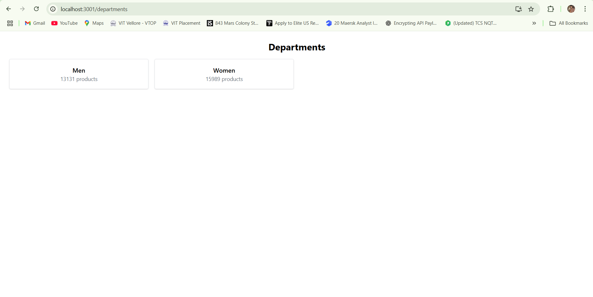
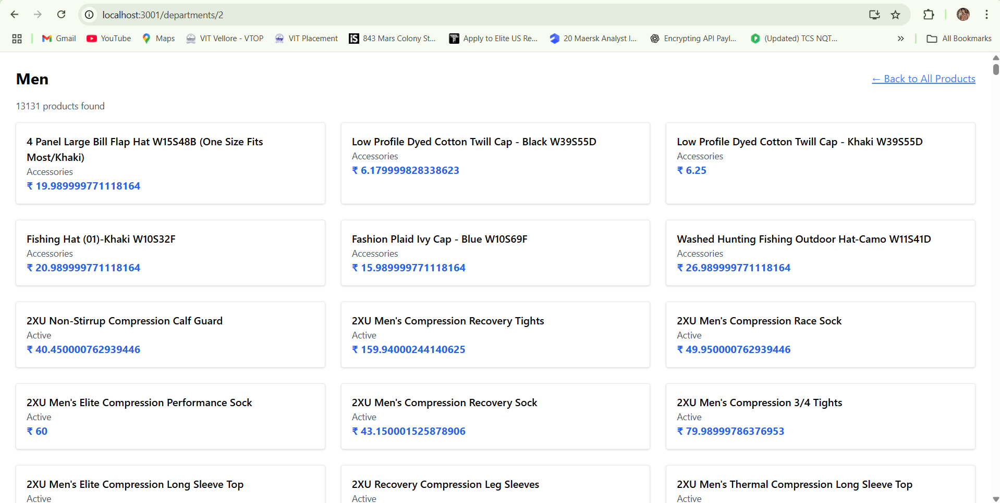
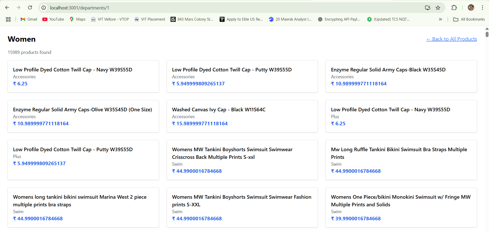

# 🛍️ Think41 E-Commerce App

A full-stack product management application built as part of the Think41 assignment. It includes backend APIs using **Node.js + Express + PostgreSQL** and frontend using **React.js** with routing and dynamic department filtering.

---

## 📸 Screenshots

### ✅ All Products Page

---

### 📂 Department List

---

### 🛒 Products in Selected Department

---

## 🚀 Features

- REST APIs for Products and Departments
- Foreign key setup between Products ↔ Departments
- Department-based filtering and navigation
- Product detail view with routing
- CSV import for bulk data load

---
